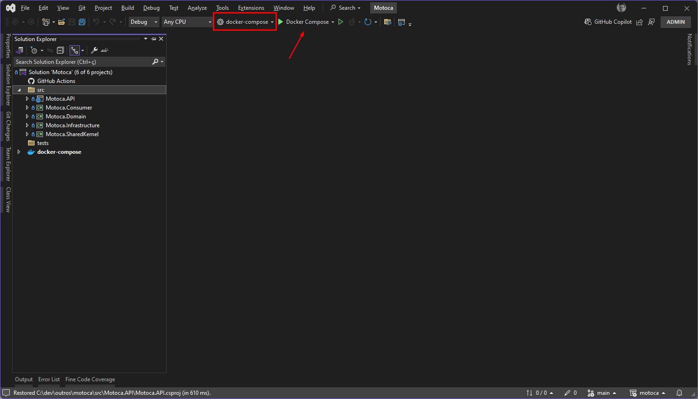
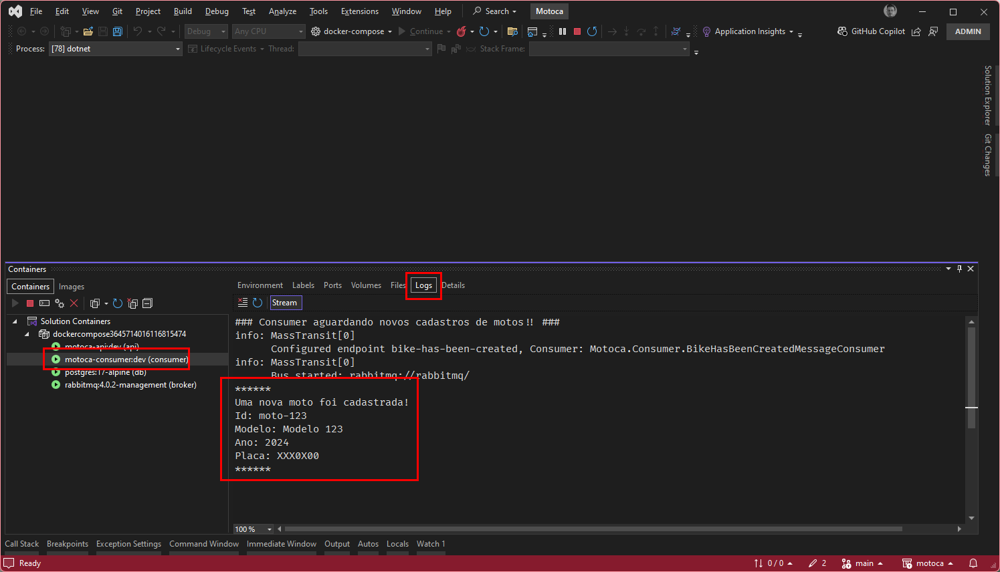
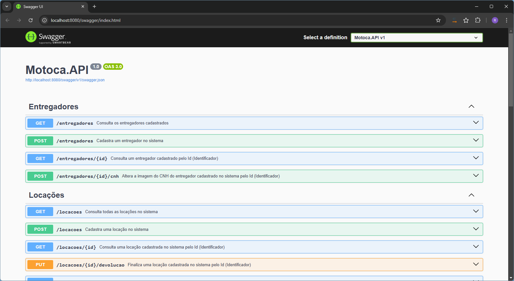
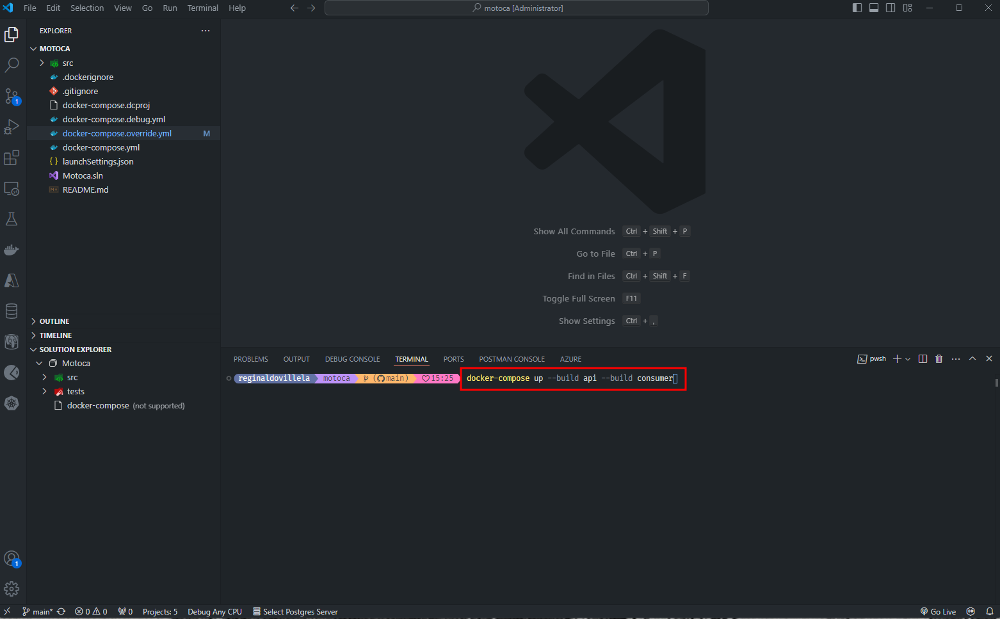
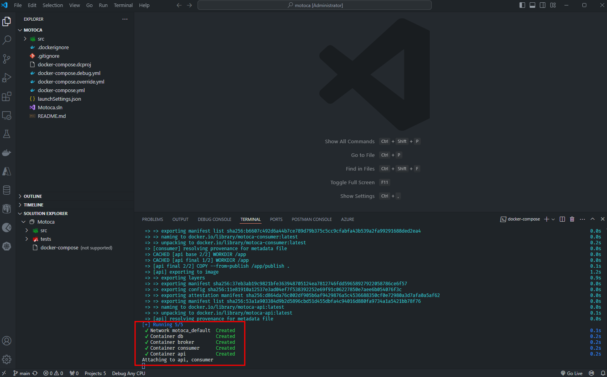
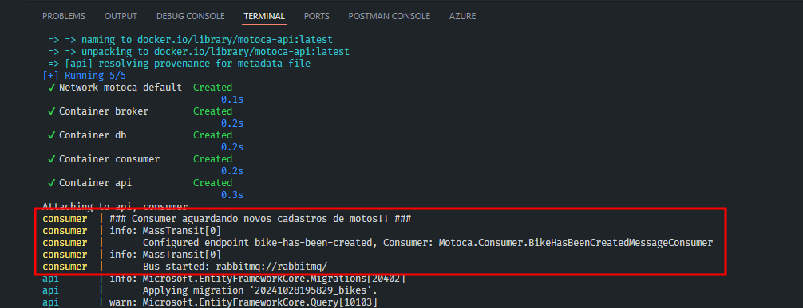
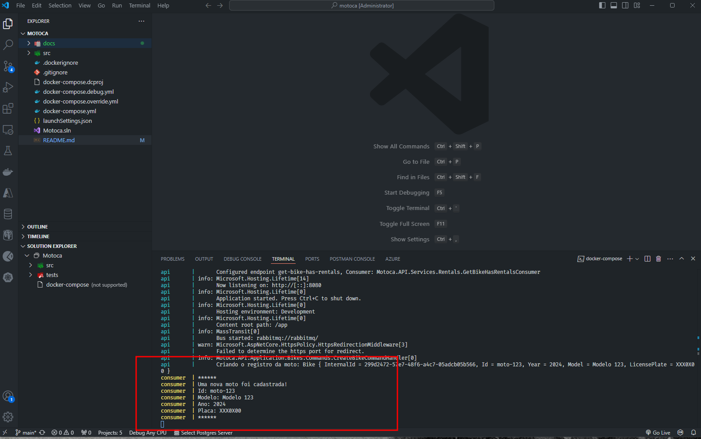

# motoca
A system to manage easily motorcycles, bikers and motorcycle rentals.

---

## Requeriments to run it
1. .net 8 SDK 8.0.403 - You can download [here](https://dotnet.microsoft.com/en-us/download/dotnet/thank-you/sdk-8.0.403-windows-x64-installer) or you can run a powershell script [here](https://dotnet.microsoft.com/download/dotnet/scripts/v1/dotnet-install.ps1)
2. Visual Studio 2022 - Download [here](https://c2rsetup.officeapps.live.com/c2r/downloadVS.aspx?sku=community&channel=Release&version=VS2022&source=VSLandingPage&cid=2030:df218f5dcfc04cbe873863980478f51a) Or VS Code download [here](https://code.visualstudio.com/docs/?dv=win64)
3. Docker Desktop - You can download [here](https://desktop.docker.com/win/main/amd64/Docker%20Desktop%20Installer.exe?utm_source=docker&utm_medium=webreferral&utm_campaign=dd-smartbutton&utm_location=module&_gl=1*bdk0md*_gcl_au*MTExMTA2OTY2NS4xNzI3MTgzNzE4*_ga*MjgxNDg5MTA5LjE3MjUwMTY5NzE.*_ga_XJWPQMJYHQ*MTcyOTc4OTYxNi4xMC4xLjE3Mjk3ODk2NDAuMzYuMC4w)

## To run it

### VS 2022

1. Select docker-compose project and click to play


2. On VS Console click at motoca-consumer container and then click at logs. You will start to see some logs when someone includes a new bike.


3. And then, together this process, a new browse windows will start. It'll be API swagger page. Here, you can try it.


---

### VS Code

1. On VS Code terminal run:
```
docker-compose up --build api --build consumer
```


2. After a while, terminal will start to get containers logs, and then, you'll be able to see motoca-consumer container logs.



3. The API Swagger page will not open together. You should do it yourself
```
http://localhost:8080/swagger
```


4. A result after a new bike had been included


## What I did and used?

1. Techs
- .Net 8
- VS Code and VS 2022 to develop
- Docker
- Docker Compose to start services
- Postgres as Database System
- RabbitMQ as Message Queue Broker System

2. Design Patterns
- DDD
- Repository
- UnitOfWork
- CQRS With MediatR
- Pub/Sub With Masstransit
- Migrations With EF Core
- IoC and DI
- Extensions Patterns
- Validators With FluentValidation